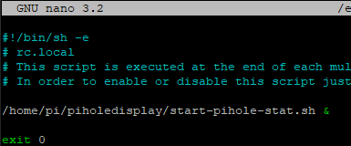

# Pihole Display

## Hardware
  - Raspberry Pi 3B+ with pihole
  - Waveshare 2.13 inch ePaper display model B (3 colors: black, white and red)
## Installation
### Waveshare display drivers
  - Install the libraries mentioned [here](https://www.waveshare.com/wiki/Pioneer600#Libraries_Installation_for_RPi).
  - Enable spi, i2c and edit the modules config file as given [here](https://www.waveshare.com/wiki/Pioneer600#Configuring_the_interfaces)
  - [Optional] Download demo code from [here](https://www.waveshare.com/wiki/File:2.13inch_e-Paper_HAT-code.7z) and run it to make sure everything is working

  - Also install the requests library and dotmap libraries (needs pip to be installed)
    ~~~~
    sudo pip install requests
    pip3 install dotmap
    ~~~~
### Final steps
  - Clone this repository onto a suitable forlder on your Pi.
    ~~~~
    git clone https://github.com/Cerbrus/piholedisplay.git
    ~~~~
  - Navigate to the `/python` folder
    ~~~~
    cd piholedisplay/python/
    ~~~~
  - Run the stats.py script using
    ~~~~
    python stats.py
    ~~~~
### Running on startup
  - Lastly we just want to make this run at boot. This can be done in different ways:
#### a: Using `rc.local`:
  - This can be done by editing `/etc/rc.local`
  - Open `rc.local`:  `sudo nano /etc/rc.local`
  -  Add `/home/pi/piholedisplay/start-pihole-stat.sh &` before `exit 0`.
  
  - Then save and you can reboot to test it out.

#### b: As a service:
  - Another option is to run it as a service:
    ~~~~
    sudo cp pihole-stats.service /etc/systemd/system
    sudo systemctl daemon-reload
    sudo systemctl enable pihole-stats.service
    ~~~~
